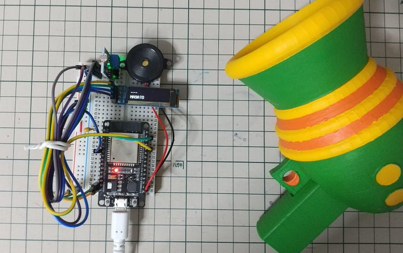

# morse-flash-signal-decoder

## What is morse-flash-signal-decoder?
* This is a tool to decode the Morse code of light from Signal lamps.

<video controls playsinline muted="false" width="480" src="img/mov.mp4" type="video/mp4">
 Sorry, your browser doesn't support embedded videos.
</video>

## Parts
* ESP32 (DOIT ESP32 DEVKIT V1)
    * https://amazon.co.jp/dp/B07MH58JS2/
* Speaker (PT08)
    * https://akizukidenshi.com/catalog/g/g101251/
* Cds sensor kit
    * https://amazon.co.jp/dp/B0BZRY5PDQ/
* OLED (SSD1306 128x32)
    * https://amazon.co.jp/dp/B085C67PF1/

## Wiring

| device | device pin | esp32 pin |
|:------:| :--------: | :-------: |
| Speaker    | black     | GND |
| Speaker    | red       | D15 |
| Cds sensor | VCC       | VIN |
| Cds sensor | GND       | GND |
| Cds sensor | DO        | D32 |
| OLED       | VCC       | VIN |
| OLED       | GND       | GND |
| OLED       | SCA       | D21 |
| OLED       | SDL       | D22 |

